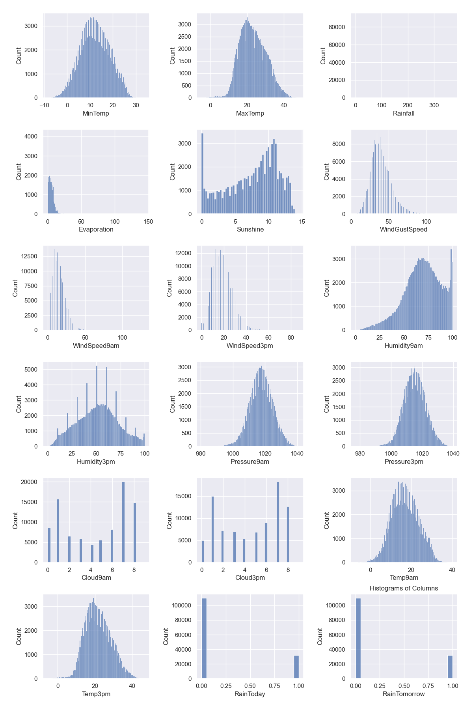
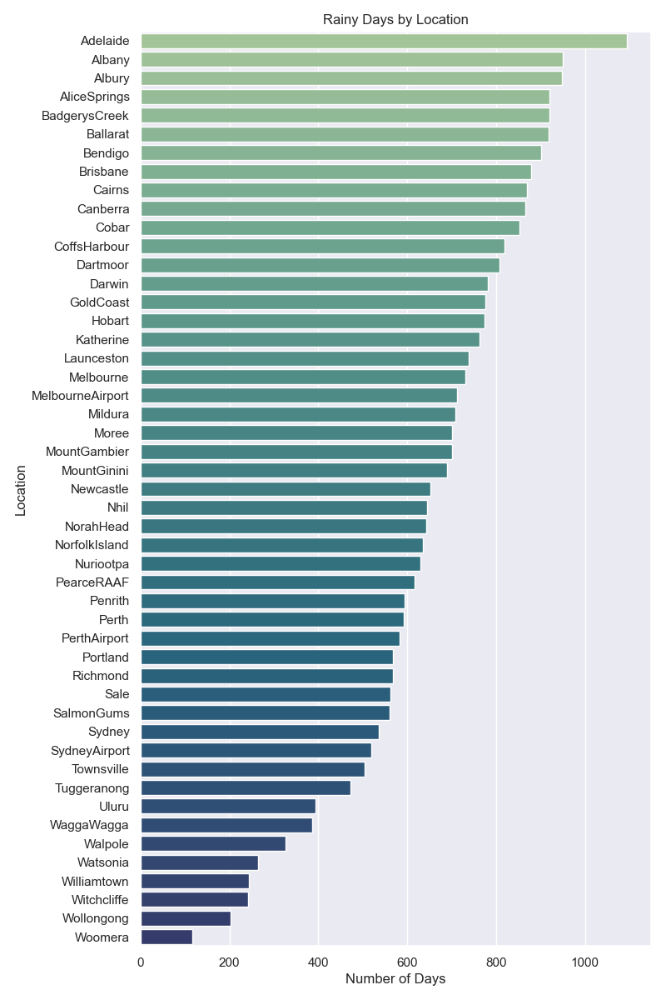
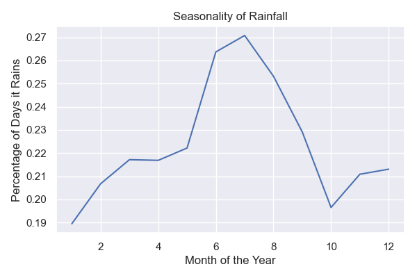
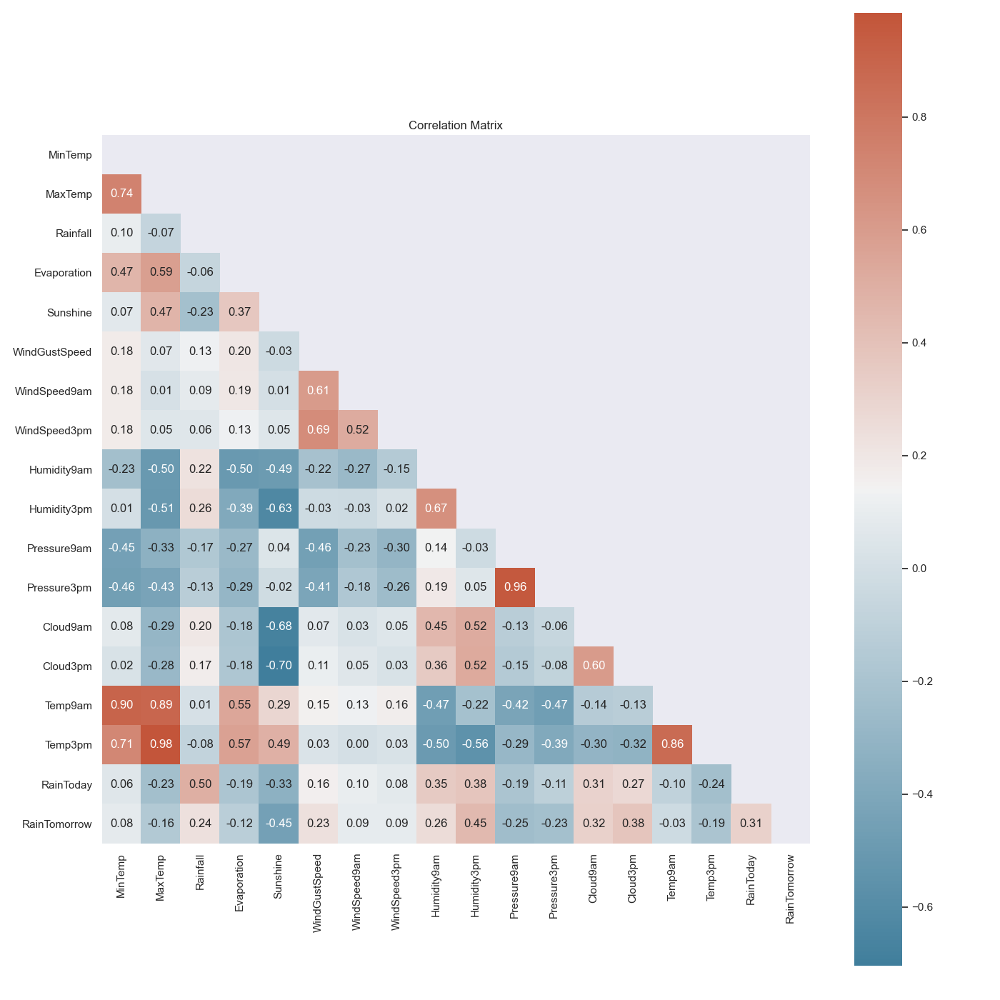
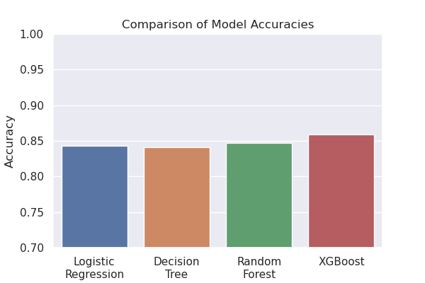
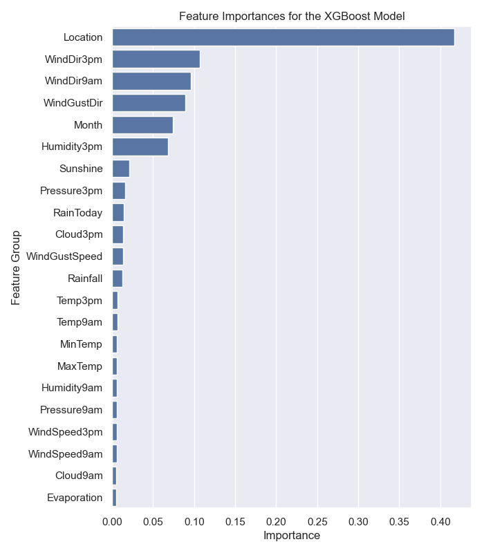

# Rain in Australia - Next-Day Prediction Model

## Project Overview
### Data Source
The data used in this project was downloaded from the Kaggle dataset titled [Rain in Australia](https://www.kaggle.com/jsphyg/weather-dataset-rattle-package), which itself was originally sourced from the Australian Bureau of Meteorology's [Daily Weather Observations](http://www.bom.gov.au/climate/dwo/). Additional weather metrics for Australia can be found within the bureau's [Climate Data Online](http://www.bom.gov.au/climate/data/) web app.

### Business Problem
Weather, and humankind's ability to accurately predict it, plays a critical role in many aspects of life. From farmers growing crops to a family planning a weekend vacation to logistical decision making within airlines, rain in particular is highly influential regarding plans. In some instances, the impact of rain can have large financial consequences. As a result, there is a strong interest from a plethora of stakeholders in the ability to accurately forecast rain. The goal of this project is to use the available data to create a next-day prediction model for whether or not it will rain. Such a model could be utilized in a weather app for the benefit of the public at large.

### Repository Structure
```
├── images/          # Exported images of plots
├── saved_models/    # Saved hyperparameter-tuned models for quick access
├── submissions/     # Files used for the project submissions
├── .gitignore
├── LICENSE
├── README.md
├── notebook.ipynb   # Jupyter notebook containing the analysis and models 
└── weatherAUS.csv   # Data on weather conditions in Australia
```

## Exploratory Data Analysis
### Column Definitions
According to the author of the Kaggle dataset and the ["Notes to accompany Daily Weather Observations"](http://www.bom.gov.au/climate/dwo/IDCJDW0000.shtml) published by the Australian Bureau of Meteorology, the meanings and units for each of the columns in the dataset are as follows:

| **Column Name** | **Definition** | **Units** |
| --------------- | -------------- | --------- |
| `Date` | Date of the observation | N/A |
| `Location` | Location of the weather station | N/A |
| `MinTemp` | Minimum temperature in the 24 hours to 9am. Sometimes only known to the nearest whole degree | Degrees Celsius |
| `MaxTemp` | Maximum temperature in the 24 hours to 9am. Sometimes only known to the nearest whole degree | Degrees Celsius |
| `Rainfall` | Precipitation (rainfall) in the 24 hours to 9am. Sometimes only known to the nearest whole millimeter | Millimeters |
| `Evaporation` | "Class A" pan evaporation in the 24 hours to 9am | Millimeters |
| `Sunshine` | Bright sunshine in the 24 hours to midnight | Hours |
| `WindGustDir` | Direction of the strongest wind gust in the 24 hours to midnight | 16 compass points |
| `WindGustSpeed` | Speed of the strongest wind gust in the 24 hours to midnight | Kilometers per hour |
| `WindDir9am` | Direction of the wind at 9am | 16 compass points |
| `WindDir3pm` | Direction of the wind at 3pm | 16 compass points |
| `WindSpeed9am` | Speed of the wind at 9am | Kilometers per hour |
| `WindSpeed3pm` | Speed of the wind at 3pm | Kilometers per hour |
| `Humidity9am` | Relative humidity at 9am | Percent |
| `Humidity3pm` | Relative humidity at 3pm | Percent |
| `Pressure9am` | Atmospheric pressure reduced to mean sea level at 9am | Hectopascals |
| `Pressure3pm` | Atmospheric pressure reduced to mean sea level at 3pm | Hectopascals |
| `Cloud9am` | Fraction of sky obscured by cloud at 9am | Eighths |
| `Cloud3pm` | Fraction of sky obscured by cloud at 3pm | Eighths |
| `Temp9am` | Temparature at 9am | Degrees Celsius |
| `Temp3pm` | Temparature at 3am | Degrees Celsius |
| `RainToday` | Did the current day receive precipitation exceeding 1mm in the 24 hours to 9am | Binary (0 = No, 1 = Yes) |
| `RainTomorrow` | Did the next day receive precipitation exceeding 1mm in the 24 hours to 9am | Binary (0 = No, 1 = Yes) |

### Observations
#### Histograms


#### Rainy Days by Location


#### Seasonality


#### Correlation Matrix


## Data Preprocessing
### Missing Values
The primary preprocessing need for this dataset is handling the missing values. Given the strong correlations between certain features, using a multivariate feature imputation method makes sense. While still experimental, the `IterativeImputer` module from `sklearn` is perfect for this use case and appears stable enough. This module...
> "...models each feature with missing values as a function of other features, and uses that estimate for imputation. It does so in an iterated round-robin fashion: at each step, a feature column is designated as output y and the other feature columns are treated as inputs X. A regressor is fit on (X, y) for known y. Then, the regressor is used to predict the missing values of y. This is done for each feature in an iterative fashion, and then is repeated for max_iter imputation rounds. The results of the final imputation round are returned."

Source: [6.4.3. Multivariate feature imputation](https://scikit-learn.org/stable/modules/impute.html#iterative-imputer)

The `IterativeImputer` was applied to all continuous features while categorical features were imputed via `np.random.choice()` with the unique values weighted by their respective probability distributions. 

### Extracting the Month
Rainfall in Australia exhibits seasonality, as shown in the EDA section. Extracting the month value from the `Date` column is a much more useful feature than the full date itself.

### Dummy Variables
After engineering the `Month` feature, the following categorical features were transformed into dummy variables via `pandas.get_dummies()`:
- `Month`
- `Location`
- `WindGustDir`
- `WindDir9am`
- `WindDir3pm`

## Modeling
Four types of models were explored and had their hyperparameters tuned:
- Logistic Regression
- Decision Tree
- Random Forest
- XGBoost

Ultimately, the XGBoost model had the best performance.






## Conclusion
## Results
The best performing model is the hyperparameter-tuned XGBoost model with an accuracy of approximately 86%. The scores for both the training and testing data were similar, reducing concerns of the model being overfit. In terms of feature importances, `Humidity3pm` is the single most important feature. However, when grouping the features back into their original categories, the following groups have the most importance:
- `Location`
- `WindDir3pm`
- `WindDir9am`
- `WindGustDir`
- `Month`
- `Humidity3pm`

## Next Steps
While this model is a good starting point for rain prediction in Australia, there are several ways in which the model could be improved upon:
- Further hyperparameter tuning
- Engineering new features such as trailing amounts of rain or sunshine
- Collecting additional data from nearby countries (for example, does rain originating in Indonesia or New Zealand have predictive power?)
- Attempting to predict the *amount* of rainfall
